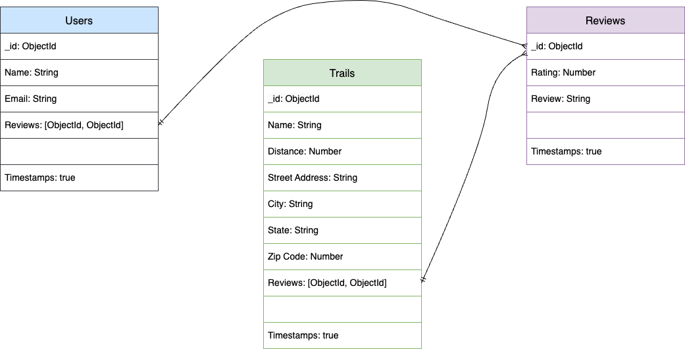
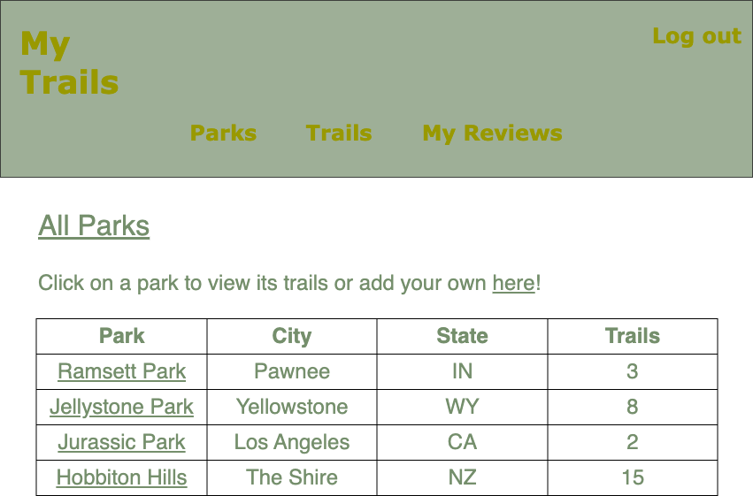
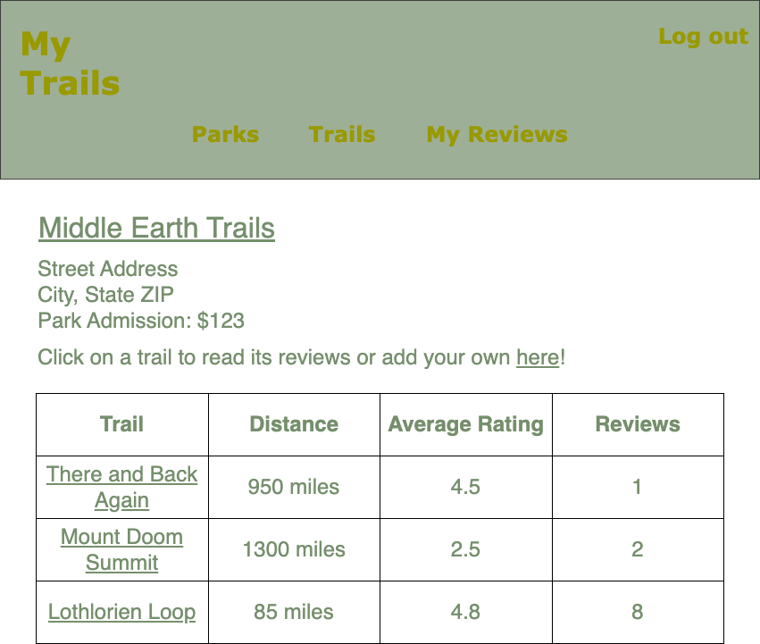
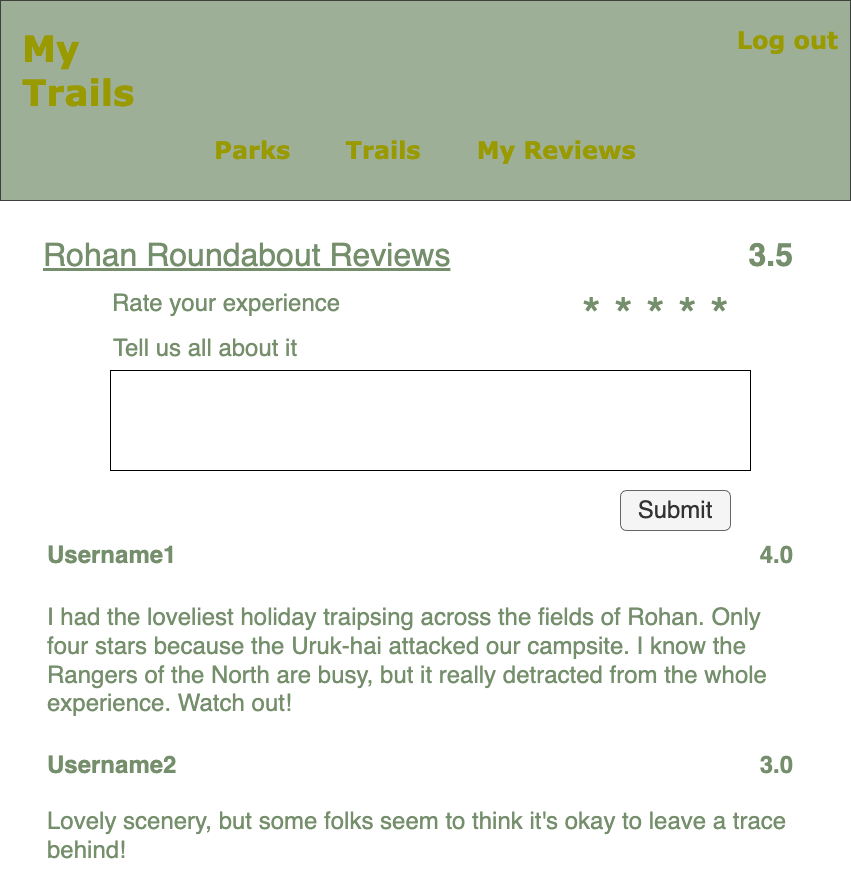
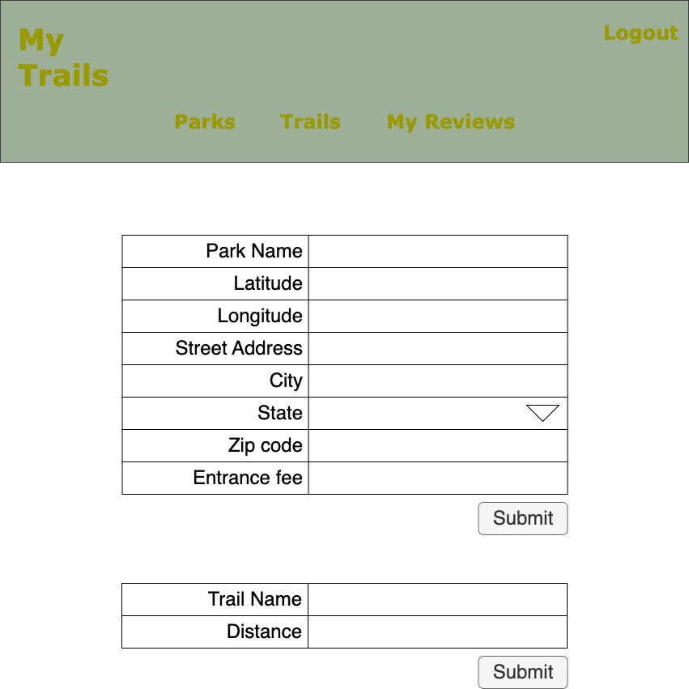

# MyTrails
MyTrails is a full stack application that crowd-sources reviews of hiking trails in parks. Parks, trails, and reviews are available to the public. Authenticated users can add new parks, trails, and reviews. Users can update or delete their own reviews.

## Technologies Used
* Lanaguages: HTML, CSS, Javascript
* Frameworks: Node.js, Express, EJS
* Authentication: OAuth (Google)
* Data Model: MongoDB
* APIs: Mapbox API, OpenWeather API
https://docs.mapbox.com/mapbox-gl-js/api/ - 50K calls/month free
https://openweathermap.org/api - 1M calls/month free

## Entity Relationship Diagram (ERD)

## RESTful Routing Chart
| HTTP METHOD (_Verb_) | URL (_Nouns_)     | CRUD    | Response          | Notes        |
| -------------------- | ----------------- | ------- | ----------------- | ------------ |
| GET | `/` | READ | Display Home page|  |
| GET | `/parks` | READ | Array of  `[{ park }, { park }]` | |
| GET | `/parks/new` | READ | Form to create new `{ park }` | |
| POST | `/parks` | CREATE | Add a new `{ park }` | Guest users directed to login |
| GET | `/parks/:id` | READ | `{ park }` | |
| GET | `/parks/:id/new` | READ | Form to create new `{ trail }` | |
| POST | `/parks/:id/trails` | CREATE | Add a new `{ trail }` | uest users directed to login |
| GET | `/trails` | READ | Array of  `[{ trail }, { trail }]` | |
| POST | `/parks/:id/trails` | CREATE | Add a new `{ trail }` | uest users directed to login |
| GET | `/trails/:id` | READ | `{ trail }` | |
| GET | `/trails/:id/reviews` | READ | Array of `[{ review }, { review }]` | |
| POST | `/trails/:id/review` | CREATE | Add a new `{ review }` | |
| PUT | `/trails/:id/review` | UPDATE | Updates a `{ review }` | Only if user created review |
| DELETE | `/trails/:id/review` | DESTROY | Deletes a `{ review }` | Only if user created review
| GET | `/users/:id` | READ | Return `{ user }` | User's reviews|
| PUT | `/users/:id/reviews/` | UPDATE | Modifies a `{ review }` | Only if user created review |
| DELETE | `/users/:id/reviews` | DESTROY | Deletes a `{ review }` | Only if user created review |

## Wireframes

## User Stories
- [] AAU, I want to create an account.
- [] AAU, I want to login/logout of my account.
- [] AAU, I want to view parks.
- [] AAU, I want to view trails in a park.
- [] AAU, I want to read reviews of a trail.
- [] AAU, I want to create a review of a trail.
- [] AAU, I want to view all trails I've reviewed.
- [] AAU, I want to update my reviews.
- [] AAU, I want to delete my reviews.

## MVP Goals
* Users  login using Google OAuth.
* Without logging in, guests can:
    - [] View a list of parks
    - [] View a list of trails for a park
    - [] View a trail's reviews
* When users login, they can:
    - [] Create a new park
    - [] Create a new trail for a park
    - [] Create a review for a trail
    - [] View a list of reviews they wrote
    - [] Update a review they wrote
    - [] Delete a review they wrote
* When a guest attempts to access user-only resources (like writing a review), direct user to login.
* "My Reviews" only displays in the menu bar when a user is logged in.

## Stretch Goals
* Embed Mapbox in the `/` page
    * Use API to display markers representing parks on the map
    * Allow users to click a marker and link to the park's page
* Display map with trail on /trails:id
* On a trail's page, sort reviews by date or rating

