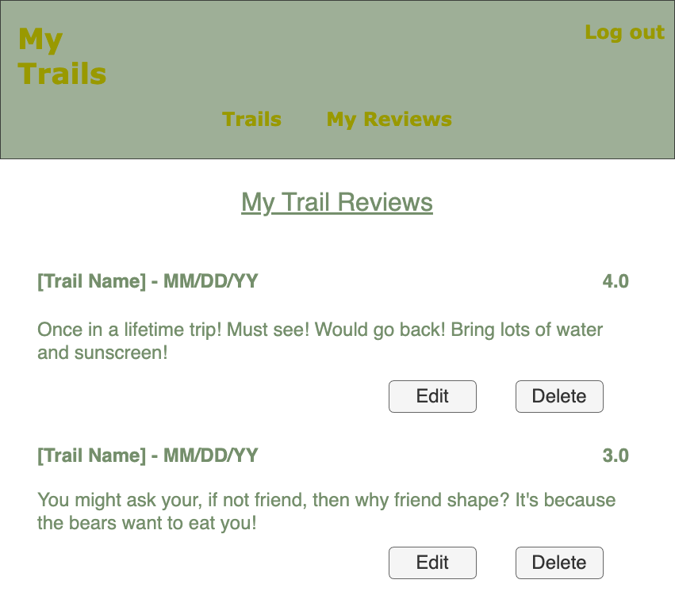
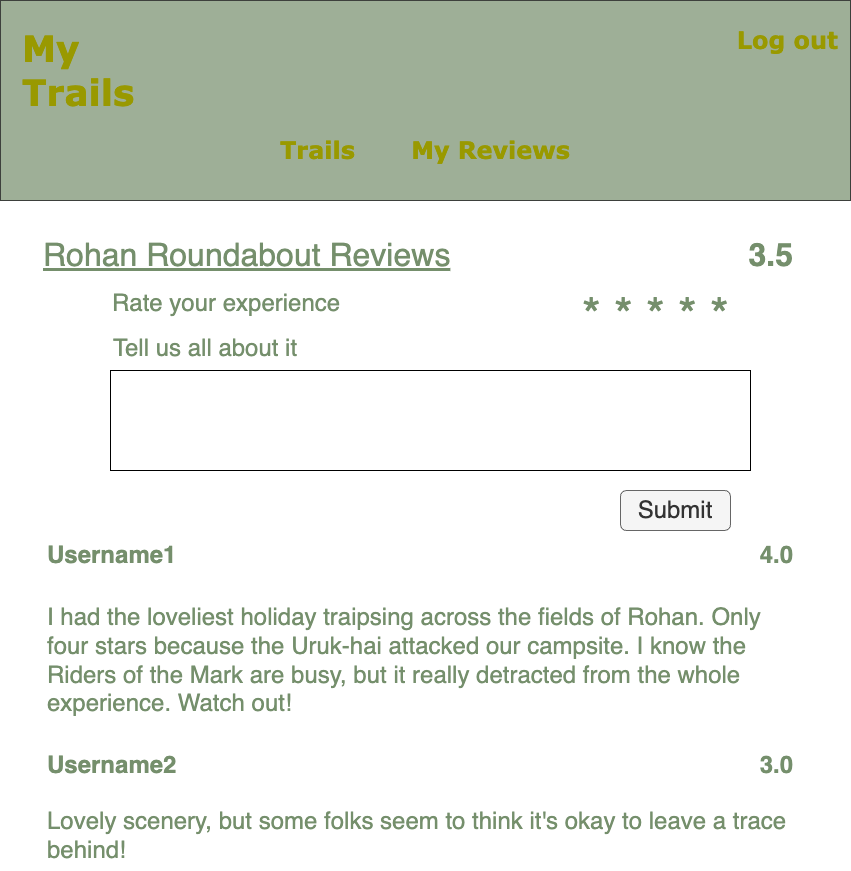

# MyTrails
MyTrails is a full stack application that crowd-sources reviews of hiking trails. Trails and reviews are available to guest users (not logged in). Authenticated users can add new reviews to trails. Authenticated users also can update or delete their own reviews.

## Technologies Used
* Lanaguages: HTML, CSS, Javascript
* Frameworks: Node.js, Express, EJS
* Authentication: OAuth (Google)
* Data Model: MongoDB
* APIs: Mapbox API
https://docs.mapbox.com/mapbox-gl-js/api/ - 50K calls/month free

## Entity Relationship Diagram (ERD)

## RESTful Routing Chart
| HTTP METHOD (_Verb_) | URL (_Nouns_)     | CRUD    | Response          | Notes        |
| -------------------- | ----------------- | ------- | ----------------- | ------------ |
| GET | `/auth/google` | READ | Directs to Google login | |
| GET | `/auth2callback` | READ | Returns `{ user }` | Select or create user in database |
| GET | `/logout` | READ | Log out
| GET | `/trails` | READ | Array of  `[{ trail }, { trail }]` | |
| GET | `/trails/new` | READ | Form to create new `{ trail }` | |
| POST | `/trails` | CREATE | Add a new `{ trail }` | |
| GET | `/trails/:id` | READ | `{ trail }` | |
| GET | `/reviews` | READ | Return `{ user }` | List of user's reviews|
| POST | `/reviews` | CREATE | Add a new `{ review }` | |
| PUT | `/reviews` | UPDATE | Modifies a `{ review }` the user wrote|  |
| DELETE | `/reviews` | DESTROY | Deletes a `{ review }` the user wrote| |

### RESTful Routes for Reach Goals
| HTTP METHOD (_Verb_) | URL (_Nouns_)     | CRUD    | Response          | Notes        |
| -------------------- | ----------------- | ------- | ----------------- | ------------ |
| GET | `/` | READ | Display Home page|  |
| GET | `/parks` | READ | Array of  `[{ park }, { park }]` | |
| GET | `/parks/new` | READ | Form to create new `{ park }` | |
| POST | `/parks` | CREATE | Add a new `{ park }` | Guest users directed to login |
| GET | `/parks/:id` | READ | `{ park }` | |
| GET | `/parks/:id/new` | READ | Form to create new `{ trail }` | |
| POST | `/parks/:id/trails` | CREATE | Add a new `{ trail }` | uest users directed to login |
| POST | `/parks/:id/trails` | CREATE | Add a new `{ trail }` | Guest users directed to login |
| PUT | `/trails/:id/review` | UPDATE | Updates a `{ review }` | Only if user created review |
| DELETE | `/trails/:id/review` | DESTROY | Deletes a `{ review }` | Only if user created review |

## Wireframes

## User Stories
- [ ] AAU, I want to create an account.
- [ ] AAU, I want to login/logout of my account.
- [ ] AAU, I want to read reviews of a trail.
- [ ] AAU, I want to create a review of a trail.
- [ ] AAU, I want to view all trails I've reviewed.
- [ ] AAU, I want to update my reviews.
- [ ] AAU, I want to delete my reviews.

## MVP Goals
* Users  login using Google OAuth.
* Without logging in, guests can:
    - [ ] View a list of trails
    - [ ] View a trail's reviews
* When users login, they can:
    - [ ] Create a review for a trail
    - [ ] View a list of reviews they wrote
    - [ ] Update a review they wrote
    - [ ] Delete a review they wrote
* When a guest attempts to access user-only resources (like writing a review), direct user to login.
* "My Reviews" only displays in the menu bar when a user is logged in.

## Stretch Goals (in order of priority)
* Embed Mapbox in the `/` page
    * Use API to display markers representing trails on the map
    * Allow users to click a marker and link to the trail's page
* Update data model
    * Create Parks collection
    * Embed Trails in park document (Name, Distance, Reviews)
    * Embed Address in park document (Lat/Long plus Street Address, City, State, Zip)
* Expand navigation after updating data model
    * Allow users to view list of parks and view a specific park
    * When viewing a specific park, users see it's details including it's trails and address
    * From a specific park's page, users can navigate to a specific trail's page to see its reviews

