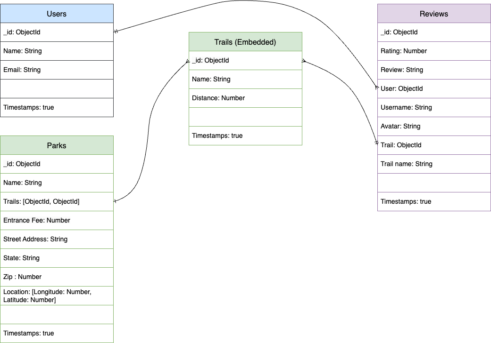

# MyTrails
MyTrails is a full stack application that crowd-sources reviews of hiking trails. The site's parks, trails, and reviews are available to guest users (not logged in). Authenticated users can add new parks and trails or add a review to a trail. Authenticated users also can edit or delete their own reviews.

## Getting Started
Access the app here: [MyTrails](https://my-trails-app-d6518553f042.herokuapp.com/)

## Screenshots

## Technologies Used
* Lanaguages: HTML, CSS, Javascript
* Frameworks: Node.js, Express, EJS
* Authentication: OAuth (Google)
* Data Model: MongoDB
* APIs: Mapbox API (https://docs.mapbox.com/mapbox-gl-js/api/)

## Entity Relationship Diagram (ERD)

## RESTful Routing Chart
| HTTP METHOD (_Verb_) | URL (_Nouns_)     | CRUD    | Response          | Notes        |
| -------------------- | ----------------- | ------- | ----------------- | ------------ |
| GET | `/` | READ | Loads Home page
| GET | `/auth/google` | READ | Directs to Google login | |
| GET | `/auth2callback` | READ | Returns `{ user }` | Select or create user in database |
| GET | `/logout` | READ | Log out
| GET | `/parks` | READ | Array of `[{park}, {park}]` | |
| GET | `/parks/new` | READ | Form to create new `{ park }` | Guest users directed to login |
| POST | `/parks` | CREATE | Add a new `{ park }` |  |
| GET | `/parks/:id` | READ | `{ park }` | |
| GET | `/trails` | READ | Array of  `[{ trail }, { trail }]` | |
| GET | `/trails/new` | READ | Form to create new `{ trail }` | Guest users directed to login|
| POST | `/trails` | CREATE | Add a new `{ trail }` | |
| GET | `/trails/:id` | READ | `{ trail }` | |
| GET | `/reviews` | READ | Return `{ user }` | List of user's reviews|
| PUT | `/reviews/:id` | UPDATE | Modifies a `{ review }` the user wrote|  |
| DELETE | `/reviews/:id` | DESTROY | Deletes a `{ review }` the user wrote| |

## User Stories
- [x] AAU, I want to create an account.
- [x] AAU, I want to login/logout of my account.
- [x] AAU, I want to see a list of all parks.
- [x] AAU, I want to see a list of park's trails.
- [x] AAU, I want to see a list of all trails.
- [x] AAU, I want to read reviews of a trail.
- [x] AAU, I want to create a new park.
- [x] AAU, I want to create a new trail for a park.
- [x] AAU, I want to create a review of a trail.
- [x] AAU, I want to view all of my reviews.
- [x] AAU, I want to update my reviews.
- [x] AAU, I want to delete my reviews.

## MVP Goals
* Users  login using Google OAuth.
* Without logging in, guests can:
    - [x] View a list of trails
    - [x] View a trail's reviews
* When users login, they can:
    - [x] Create a review for a trail
    - [x] View a list of reviews they wrote
    - [x] Update a review they wrote
    - [x] Delete a review they wrote
* When a guest attempts to access user-only resources (like writing a review), direct user to login.
* "My Reviews" only displays in the navigation bar if a user is logged in.

## Stretch Goals (in order of priority)
* Embed Mapbox in the `/` page
    [x] Use API to display markers representing parks on the map
    [x] Allow users to click a marker containing a clickable link to the park's page
* Update data model
    [x] Create Parks collection, where the park document contains the address and location ([longitude,latitude])
    [x] Embed Trails in park document (Name and Distance)
* Expand navigation after updating data model
    [x] Allow users to view list of parks
    [x] Allow users to to click on a park to view its address and trails
    [x] Allow users to click on a trail (on a specific park's page) to navigate to the trail's page

## Next Steps
* Redirect users back to the Park page after creating a trail for that park
* Add trail's average rating to `/trails` and `/trails/:id`
* Implement sorting for `/parks` and `/trails`
* Implement search for `/parks` and `/trails`

